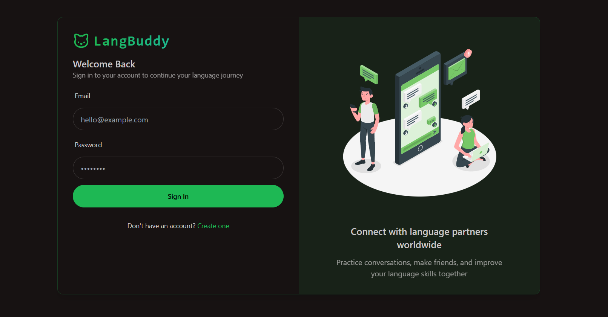

# LangBuddy – Multilingual Friendship Platform

LangBuddy is a **learning project** built using the **MERN stack (MongoDB, Express.js, React.js, Node.js)**.  
The main objective of this project was to **understand API integration, backend–frontend communication, and deployment structure** in a full-stack application.
It was created as a **practice project** to strengthen my understanding of web development concepts.

---

## 🚀 Features (Learning Scope)
- User registration and basic profile management  
- Connecting users based on multilingual preferences  
- Chat functionality (getstream.io API)
- Hands-on practice with REST APIs and database handling  

---

## 🛠️ Tech Stack
- **Frontend:** React.js, TailwindCSS  
- **Backend:** Node.js, Express.js  
- **Database:** MongoDB  
- **Other Tools:** Postman (API testing), Git, npm  

---

## 📸 Screenshots
### Homepage


### Chat Interface


### Login Page


## 🎯 What I Learned
- Setting up a full-stack project using the MERN architecture  
- Using APIs to connect frontend and backend  
- Handling state management in React  
- Basic authentication and database operations with MongoDB  
- Structuring a project for scalability  

---

## ⚡ How to Run the Project
1. Clone the repository  
   ```bash
   git clone https://github.com/chethans2005/LangBuddy.git
   cd LangBuddy
2. Run the Backend
   ```bash
   cd backend
   npm install
   npm run dev
3. Run the Frontend
   ```bash
   cd frontend
   npm install
   npm run dev
